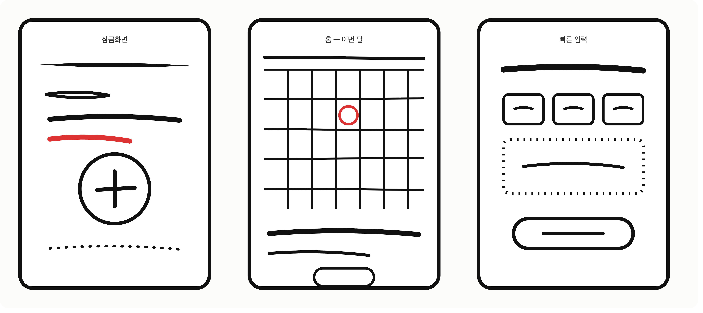

# Pitch

<!-- Under 500 words. -->

## Problem

<!-- one scene from your own life: when, what you did, what went wrong -->

## Who else?

<!-- one person other than you: what they did the last time it happened -->

## Existing solutions

<!-- what people use today, and why it isn't enough -->

## Solution

<!-- the core flow as a sketch, and where its data comes from -->

## No-gos

<!-- at least three things worth doing that you won't -->
